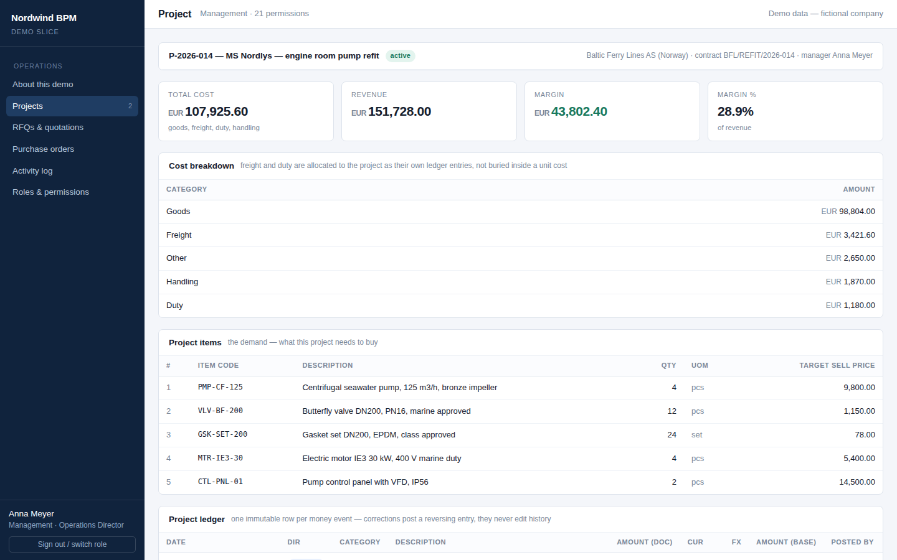
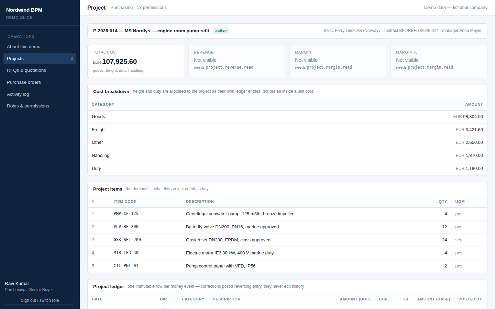
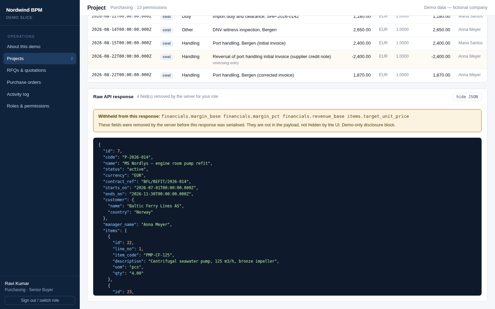
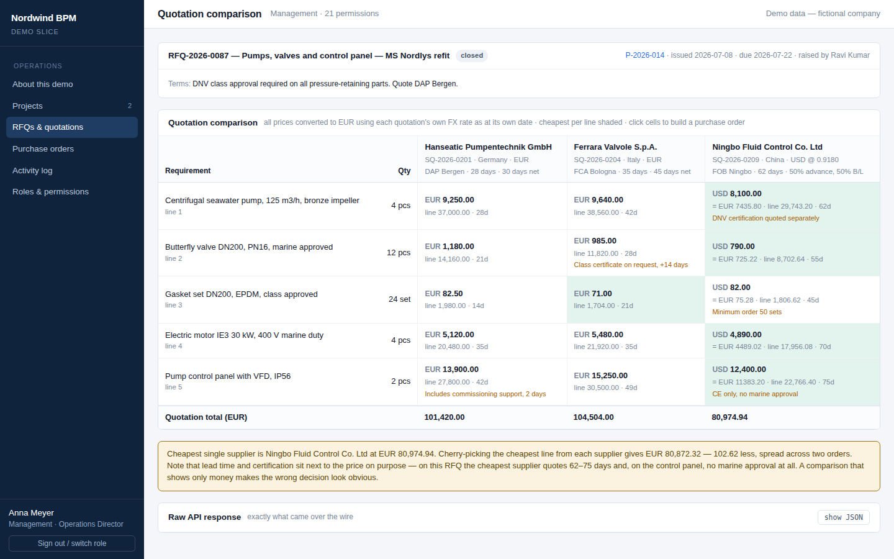
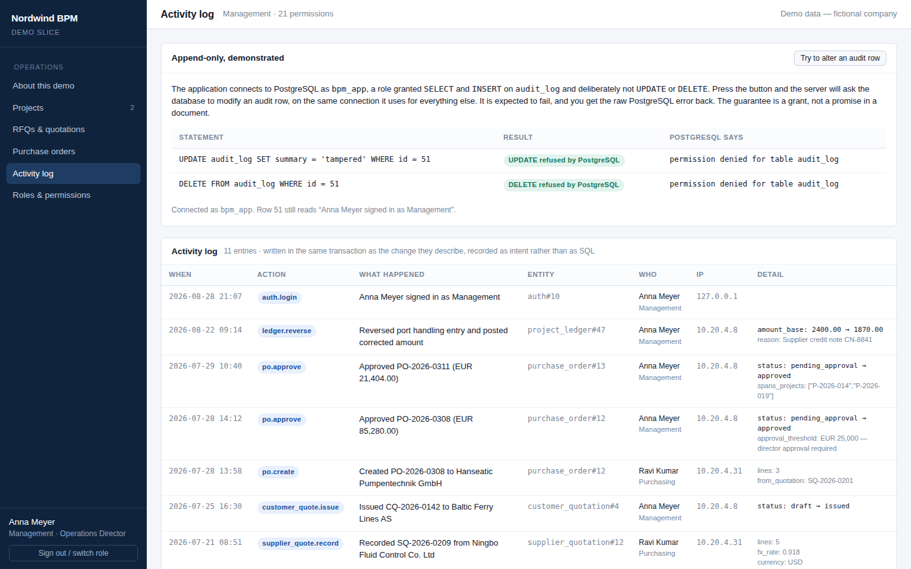
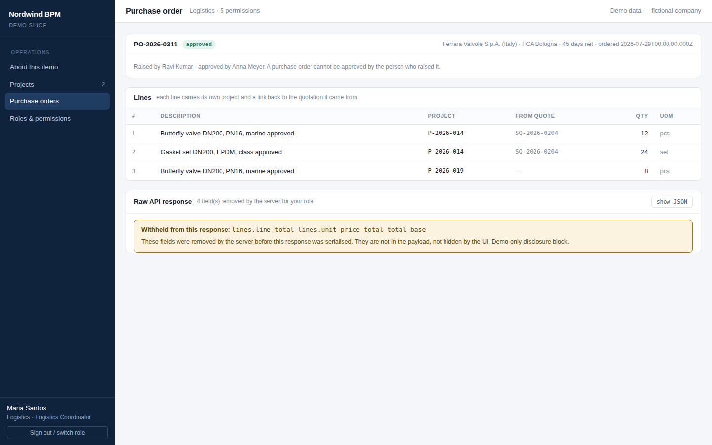
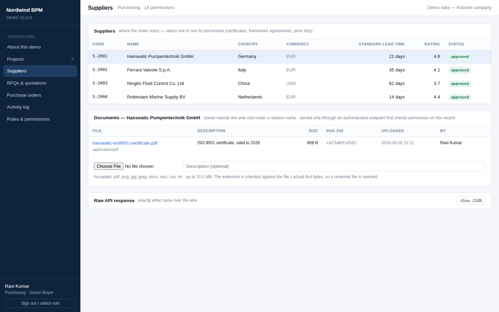
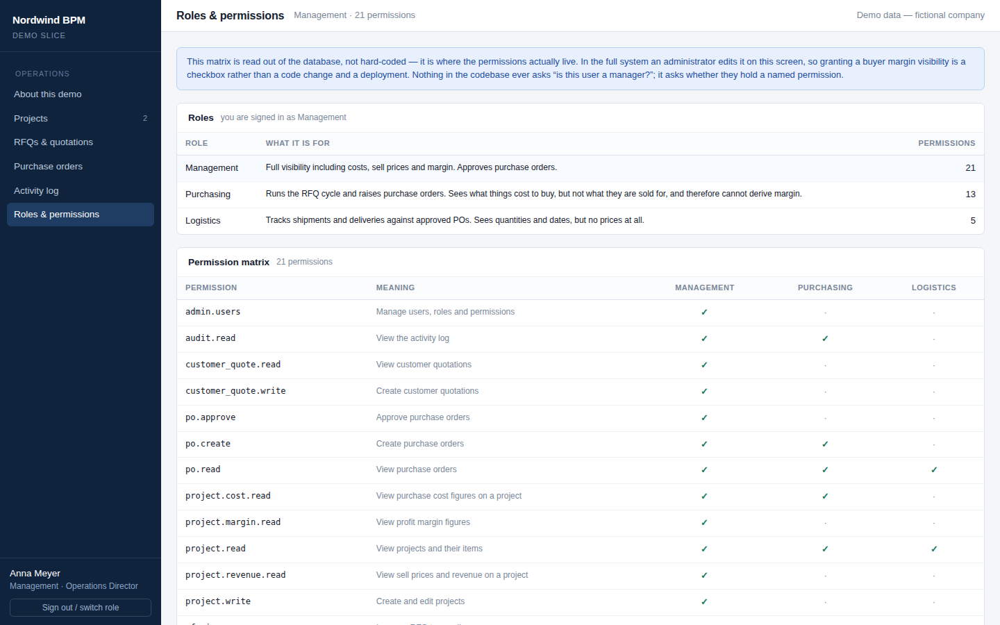

# Nordwind BPM — demo slice

A working slice of a business, project and operations management system:
**RFQ → supplier quotations → comparison → purchase order → project cost →
profitability**, with role-based access control, field-level data permissions,
an append-only audit log and a fixed-point money model.

Node.js 22 + TypeScript + Fastify · React 18 + Vite · PostgreSQL 16.

Built as a demonstration piece. The company, the suppliers and the numbers are
fictional; the mechanics are real, and this is the same architecture I would
build the production system on.

---

## Run it

Two routes. Both leave your machine as they found it.

### Docker

```bash
docker compose up
```

Then open <http://localhost:8140>.

### No Docker

Needs **Node.js 22+** and the **PostgreSQL 16** binaries installed (the server
binaries, not just `psql` — `apt install postgresql-16`, or
`brew install postgresql@16`).

```bash
./run-demo.sh
```

The script initialises its own PostgreSQL cluster inside `.pgdata`, on port
5439, running as your own user. It does not need root, does not touch any
PostgreSQL you already have, and does not install anything system-wide. First
run takes a few minutes (npm install); after that it is a few seconds.

```bash
./run-demo.sh stop     # stop the app and the database
./run-demo.sh reset    # wipe and reseed the demo data
```

### Sign in

| Email | Role | Sees |
|---|---|---|
| `anna.meyer@nordwind-demo.com` | Management | cost, revenue, **and margin**; approves POs; deletes documents |
| `ravi.kumar@nordwind-demo.com` | Purchasing | purchase cost only — no sell price, so no margin |
| `maria.santos@nordwind-demo.com` | Logistics | quantities and dates, **no prices at all** |

Password for all three: `demo1234`. The sign-in screen has one-click buttons.

---

## What to look at, in this order

### 1. The same project, two roles

Open **Projects → P-2026-014** as Anna, then as Ravi.





The margin has not been hidden by CSS. Every page has a **raw API response**
panel at the bottom — open it as Ravi and search the JSON. The fields are not
there.



That is enforced in one place: [`server/src/core/projection.ts`](server/src/core/projection.ts)
declares field-path → required-permission, and every response goes out through
`project()` in [`respond.ts`](server/src/core/respond.ts). Adding a sensitive
field is one line. Forgetting to protect it on one of the endpoints that return
a project is not possible, because there is one choke point rather than eleven.

The `_redacted` block naming the withheld fields is a **demo affordance** and is
switched off in production — telling a caller precisely which fields exist and
are being withheld is free reconnaissance.

### 2. Deriving what you cannot read

Field-level projection is not enough on its own. If purchasing could read the
revenue rows of the project ledger they could sum them, subtract the cost they
are allowed to see, and reconstruct the margin that was just removed.

So the ledger is filtered by **row** as well —
[`projects.service.ts`](server/src/modules/projects.service.ts) drops revenue
rows for anyone without `project.revenue.read`. Checking that a restricted
figure cannot be *derived* from the permitted ones is the part that usually gets
missed.

### 3. The quotation comparison

**RFQs → RFQ-2026-0087.** Three suppliers, one of them quoting in USD.



Every price is converted to the project's base currency using **each
quotation's own FX rate as at its own date**, stored on the quotation row. Look
up "today's rate" when rendering instead and your historical margins move every
morning.

Cheapest per line is shaded, but lead time, incoterm and certification notes sit
next to the price on purpose. On this RFQ the cheapest supplier is 62–75 days
away and, on the control panel, has no marine approval at all. A comparison that
shows only money makes the wrong decision look obvious.

As Ravi, click cells and press **create purchase order**. A mixed selection
becomes one order per supplier, because a PO goes to one supplier.

### 4. Approval, and where cost becomes real

A new PO is always raised `pending_approval` — purchasing does not hold
`po.approve`, and a PO cannot be approved by the person who raised it. Sign in
as Anna and approve it: the status change, the **cost entries posted to the
project ledger** and the audit row all happen in one transaction. Reopen the
project and the margin has moved.

Cost reaches the ledger at approval and nowhere else. If some POs could skip
that step, their spend would silently never appear in profitability.

### 5. Append-only, demonstrated rather than asserted

**Activity log → “try to alter an audit row”.**



The server asks PostgreSQL to `UPDATE` and then `DELETE` an audit row, on the
same connection it uses for everything else, and you get the raw error back.
The application connects as `bpm_app`, which is granted `SELECT` and `INSERT` on
`audit_log` and deliberately not `UPDATE` or `DELETE` — see
[`002_app_role.sql`](server/src/db/migrations/002_app_role.sql). The guarantee is
a `GRANT`, not a promise in a document.

Audit rows are written **inside the same transaction** as the change they
describe, so there is no code path that mutates a record and leaves no trace.
They record intent (`po.approve`, by whom, with the threshold that applied) —
what a trigger gives you is `UPDATE purchase_orders SET status='approved'`, which
answers a different question.

### 6. One order, two projects

**PO-2026-0311** covers valves for P-2026-014 *and* eight more of the same valve
for P-2026-019, consolidated onto one order to hit a price break.



That is why `project_id` sits on the PO **line**, not the header. Model the
document chain as each document pointing at the previous one and this is
unrepresentable — along with partial deliveries and shipments that carry lines
from three different orders. It is the most expensive modelling mistake in a
procurement system, because you cannot unwind it once real data is in there.

### 7. Documents

Attachments hang off suppliers, projects, RFQs and purchase orders.



Four things worth knowing about how they are handled:

**Files never sit in the web root** and nothing serves them directly. They live
under `.storage/YYYY/MM/<uuid>.<ext>` with a random name that says nothing about
the contents, and downloads go through
[`documents.routes.ts`](server/src/modules/documents.routes.ts), which checks
permission on the owning record and only then streams the bytes. A URL that
leaks out of somebody's inbox is worth nothing to whoever finds it.

**Access is decided by the owning record**, not by a per-file ACL — you may read
this document because you may read the purchase order it is attached to. Both
halves are checked: the permission (may this role read POs at all) and the
row-level scope (is this PO on a project they are assigned to). Try
`GET /api/documents/2/download` as Maria and you get a 404, not a 403 — a 403
would confirm the document exists.

**The extension is checked against the file's actual first bytes.** Rename a
text file to `.pdf` and the upload is rejected: an extension is a claim, magic
bytes are evidence. Uploads stream to disk while hashing, so the 15 MB cap is a
cap on the volume rather than on process memory, and a rejected upload leaves no
half-written file behind.

**Deletes are soft.** The row is marked and the blob is removed later by
[`reap-documents.ts`](server/src/db/reap-documents.ts), run from cron with a
grace period. Somebody deletes the wrong attachment on a Friday and wants it
back on Monday — and unlinking a path straight out of the database, at the
moment a request asks you to, is how a bad path takes something else with it.
Every read of a path goes through `safeJoin`, which refuses anything resolving
outside the storage root.

Uploads, downloads, deletions **and denied attempts** are all written to the
audit log. On a system holding supplier pricing, who read what is exactly the
question that gets asked later.

### 8. Roles and permissions



Read live from the database, because that is where permissions live. Nothing in
the codebase asks `if (user.role === 'manager')`; it asks
`can(user, 'project.margin.read')`. In the full system this screen is editable,
so granting a buyer margin visibility is a checkbox, not a deployment.

---

## How it is put together

```
server/
  src/
    core/           dec.ts (fixed-point money) · permissions.ts · projection.ts
                    respond.ts · auth.ts · audit.ts · password.ts
    db/             migrations/*.sql · types.ts · migrate.ts · seed.ts
    modules/        <domain>.routes.ts  (HTTP, guards, validation)
                    <domain>.service.ts (business rules, scoping)
    app.ts          wiring, hooks, security headers, static bundle
web/
  src/              React + TanStack Query, pages/ and components/
```

Layer rule: routes do no business logic, services do no SQL, repositories do no
business rules.

**Fastify, not Express** — JSON-schema validation in the routing layer, so a
malformed request never reaches my code, and the OpenAPI spec comes from the
same schemas.

**Kysely, not an ORM** — a typed query builder that emits real SQL. Prisma is
pleasant until you need the reporting queries this system exists for (window
functions, lateral joins, `GROUP BY ROLLUP`), at which point you drop to raw SQL
and have lost the type safety you paid for.

**Money is `NUMERIC(18,6)`** in PostgreSQL, arrives as a string, and is
calculated in [`core/dec.ts`](server/src/core/dec.ts) on BigInt micro-units.
Nothing does money arithmetic in a JavaScript number. Line totals are rounded
once, at the line; the document total is the sum of already-rounded lines — the
other way round and the printed PO does not add up and the supplier queries it.

**Migrations are numbered, forward-only SQL applied by an explicit command**,
never at application boot. I have cleaned up after an app that ran its schema
sync on startup and had four workers race each other to create the same tables.

**Every route must declare a permission or `public: true`**, asserted at boot —
[`assertEveryRouteIsGuarded`](server/src/core/auth.ts). Ship an endpoint without
a guard and the server refuses to start. I would rather fail a deploy than leak
a margin.

**File storage is swappable.** Everything the application sees is an opaque
storage path; moving to S3 or MinIO is a change to
[`core/storage.ts`](server/src/core/storage.ts) and nothing else.

**Sessions are server-side and stored hashed.** Revocation is immediate, which a
stateless JWT cannot do before it expires, and a database dump yields no usable
tokens. Cookie is `httpOnly`, `SameSite=Strict`.

---

## Not in this slice

Shipments and goods receipt, tasks and notifications, the customer quotation
editor, and the admin screens for editing roles. Those are
later milestones. This slice covers the decisions that are hardest to reverse
once real data exists: the permission model, the line-level document links, and
the money.

Two shortcuts taken knowingly, both marked in the code: passwords use scrypt
from the Node standard library rather than Argon2id, so the demo installs with
no build toolchain; and the seed runs on an empty database, which is right for a
demo and wrong for production, where seeding is a one-off deployment step.
